---
# 📉 Churn Prediction – Predição de Cancelamento de Clientes

Este projeto simula e implementa um sistema de análise e predição de churn (cancelamento) para empresas de serviços, utilizando **Python**, **Machine Learning** (Random Forest), visualização interativa e dashboard em Streamlit.

---

## ✨ Objetivo

**Identificar clientes com maior risco de cancelar o serviço (churn) antes que o cancelamento aconteça, permitindo ações proativas de retenção.**

---

## 🗂️ Estrutura do Projeto

```bash

churn-prediction/
├── data/
│   └── churn\_data.csv
├── notebooks/
│   ├── 00\_gera\_churn\_data.py
│   ├── 01\_eda\_e\_preprocessamento.ipynb
│   └── 02\_modelagem\_e\_avaliacao.ipynb
├── app/
│   ├── dashboard.py
│   └── modelo\_churn.pkl
├── imgs/
│   └── (prints e gráficos do projeto)
├── requirements.txt
└── README.md

````

---

## 🚀 Como Rodar o Projeto

### 1. **Crie o ambiente e instale as dependências**

```bash
python -m venv venv
# Ative o ambiente virtual:
# Windows:
venv\Scripts\activate
# Linux/macOS:
source venv/bin/activate

pip install -r requirements.txt
````

### 2. **Gere o dataset sintético**

```bash
python notebooks/00_gera_churn_data.py
```

### 3. **Execute os notebooks**

* **01\_eda\_e\_preprocessamento.ipynb:** Análise exploratória, visualização, split de dados
* **02\_modelagem\_e\_avaliacao.ipynb:** Treinamento, avaliação, interpretação, exportação do modelo (`modelo_churn.pkl`)

### 4. **Rode o dashboard**

```bash
streamlit run app/dashboard.py
```

---

## 📊 **Sobre o Dataset (`data/churn_data.csv`)**

A base simula 10.000 clientes com as seguintes colunas:

* `id`: identificador único
* `idade`: idade do cliente
* `tempo_cliente`: tempo como cliente (meses)
* `mensalidade`: valor mensal pago
* `suporte_ligacoes`: número de contatos com o suporte no último mês
* `tem_servico_extra`: 1 se o cliente tem serviço extra, 0 caso não tenha
* `pagamento_em_dia`: 1 se paga em dia, 0 se tem inadimplência
* `churn`: 1 se cancelou, 0 se manteve

---

## 📝 **Fluxo do Projeto**

### **1. Análise Exploratória (EDA)**

* **Distribuição do churn:**
  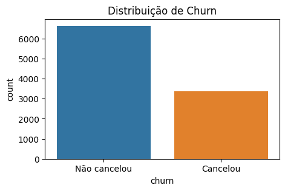

  > Mostra a proporção de clientes que cancelaram. Normalmente, a maioria não cancela – importante observar se o problema é desbalanceado.

* **Distribuição de variáveis numéricas:**
  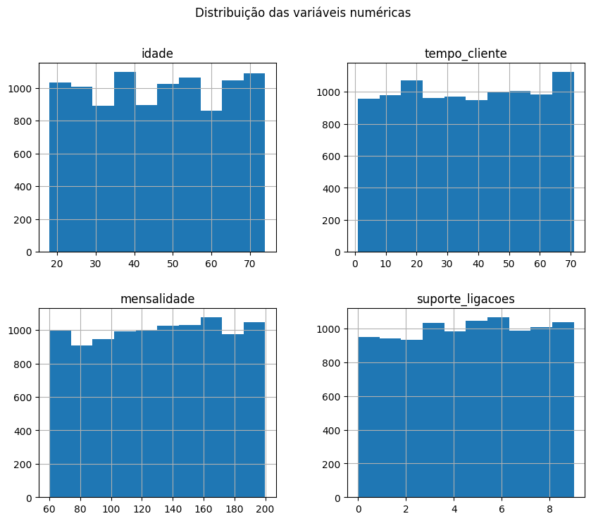

  > Ajuda a entender perfis de idade, mensalidade e tempo de cliente.

* **Boxplots de features vs. churn:**
  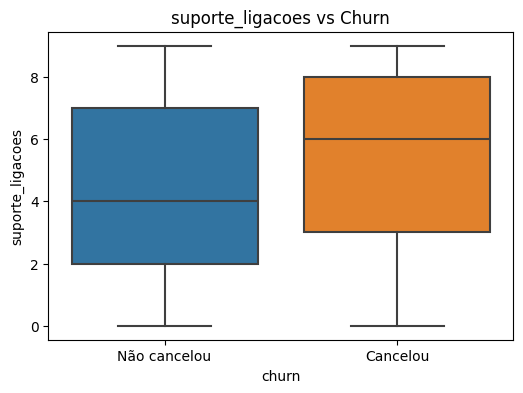

  > Clientes que ligam mais para o suporte tendem a cancelar mais. Boxplots facilitam essa visualização.

* **Churn por variáveis categóricas:**
  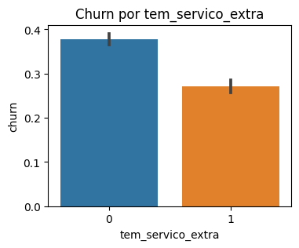

  > Mostra a influência de cada fator no cancelamento.

* **Matriz de correlação:**
  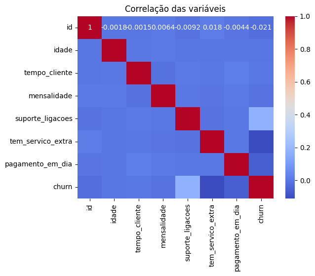

  > Destaca possíveis relações entre as variáveis (ex: atraso em pagamento aumenta churn).

---

### **2. Modelagem e Avaliação**

* **Treinamento com Random Forest**

* **Métricas principais:**
  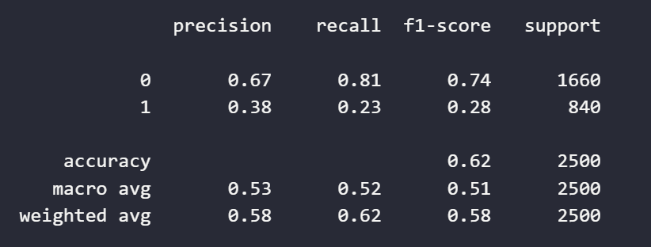

  > *Precision, recall, f1-score e support para cada classe (churn e não churn).*

  * **Precision:** % dos clientes preditos como churn que realmente cancelam.
  * **Recall:** % dos clientes que cancelaram e foram detectados.
  * **F1-score:** equilíbrio entre precision e recall.

* **Matriz de confusão:**
  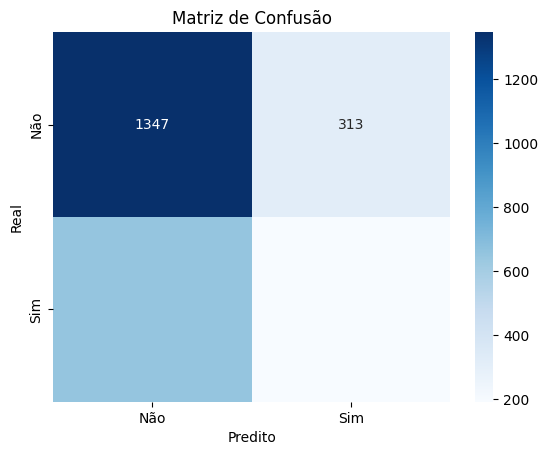

  > Permite visualizar quantos churns o modelo realmente captou e quantos errou.

* **Curva ROC-AUC:**
  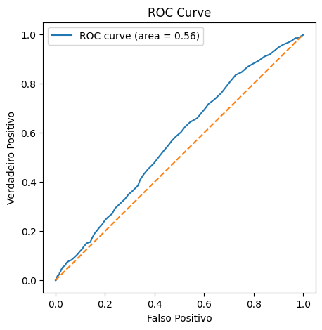

  > Mede a performance geral; quanto mais próximo de 1, melhor.

* **Importância das variáveis:**
  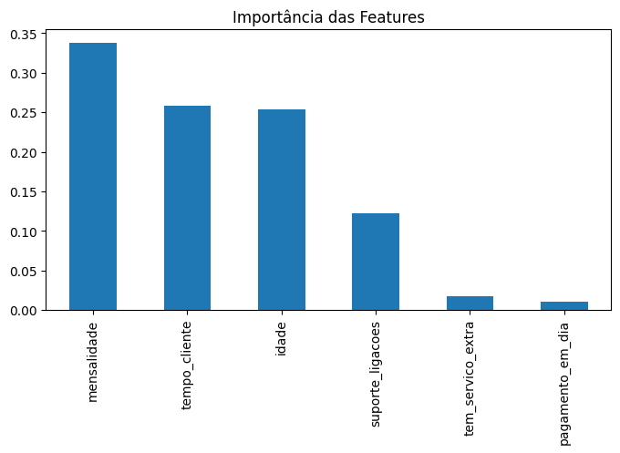

  > Mostra quais fatores mais influenciam o risco de churn (por exemplo, atraso no pagamento e muitas ligações ao suporte).

---

### **3. Dashboard Interativo**

O dashboard permite:

* Visualizar estatísticas gerais
* Prever risco de churn de clientes individualmente, preenchendo seus dados
* Observar a distribuição de churn na base


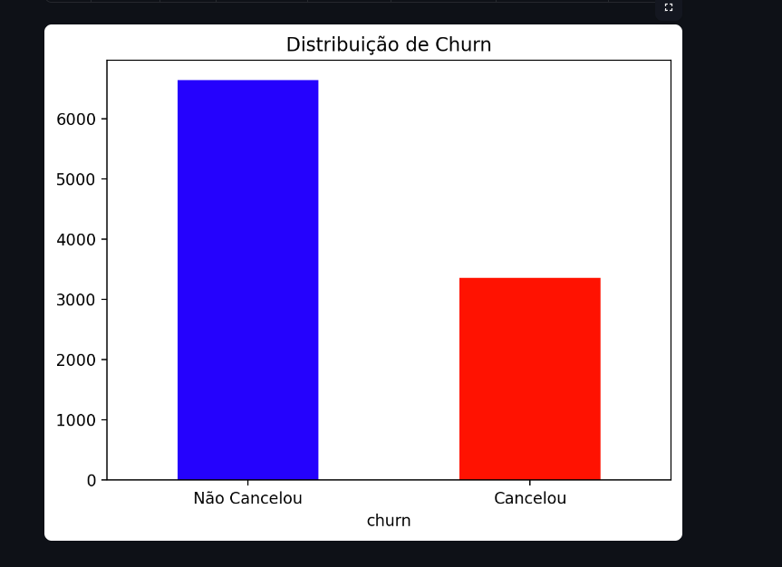
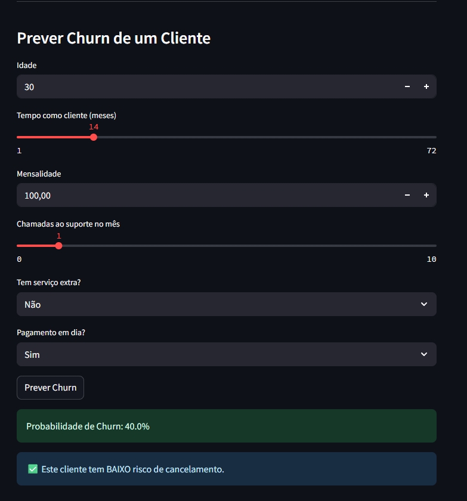
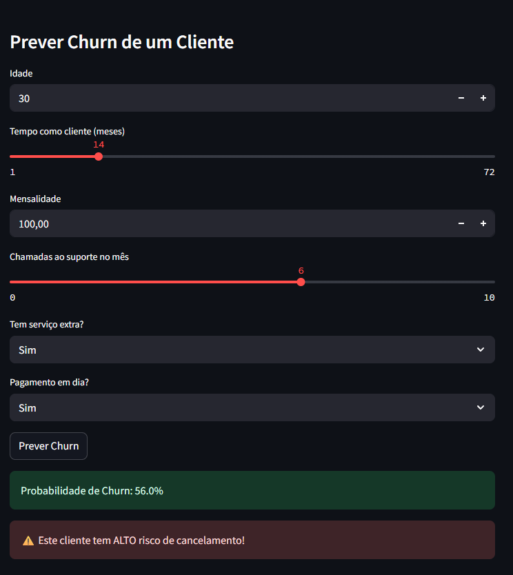

---

## 💡 **Principais Insights**

* Clientes que ligam frequentemente para o suporte e/ou têm pagamentos em atraso têm muito mais chance de churn.
* Serviços extras podem ajudar a reter clientes.
* O modelo pode ser usado para gerar alertas automáticos para equipes de retenção.

---

## 🔬 **Expansões Possíveis**

* Testar algoritmos diferentes (XGBoost, Logistic Regression)
* Ajustar hiperparâmetros
* Usar SHAP/LIME para explicabilidade individual
* Integrar com banco de dados ou APIs reais
* Implementar campanhas automáticas de retenção baseadas na predição

---


## 👤 **Autor**

Desenvolvido por [Luiz Nelson](https://github.com/luizznelson)
